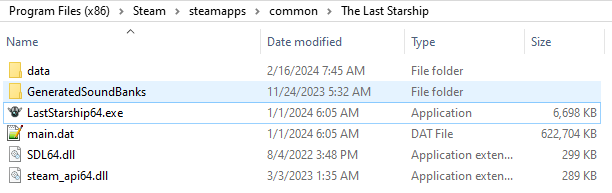

# LastStarshipTranslations
Translation files for Introversion's The Last Starship.

## Installation

1. Download the [latest release](https://github.com/Totengeist/LastStarshipTranslations/releases).
2. Extract the contents of the zip file into the game directory:
    * Steam: C:\Program Files (x86)\Steam\steamapps\common\The Last Starship
3. Once complete, you should see a `data` directory in the same directory as the game executable:

## Thanks to

emap0707 - [Spanish Translation](https://steamcommunity.com/sharedfiles/filedetails/?id=3161472668)  
Fabisims [French Translation](https://steamcommunity.com/sharedfiles/filedetails/?id=3122540653)
